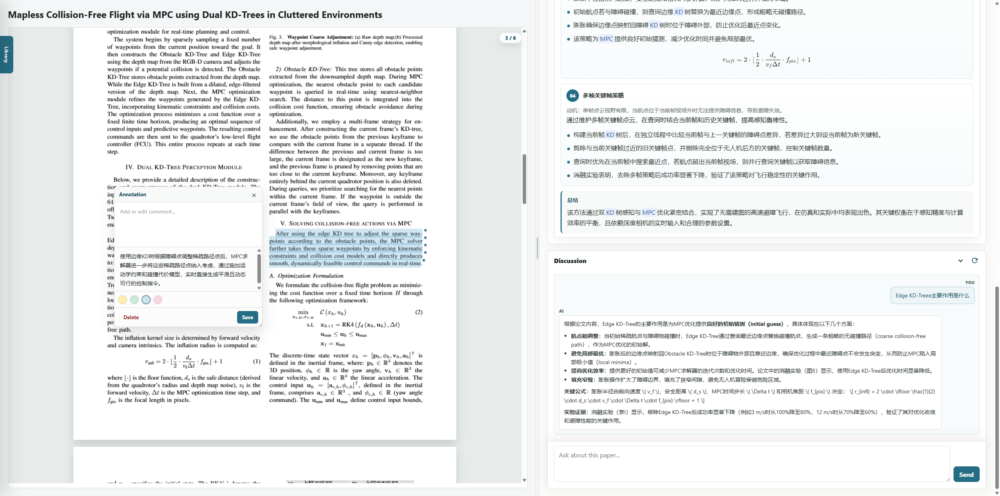

# Paper Lantern

Paper Lantern 是一个本地优先、开源共享的论文阅读与文献管理工具。

它把论文导入、PDF 阅读、AI 总结、选中文本翻译/解释、批注、讨论记录和文献库同步放在你自己的机器上运行。你可以管理本地文献库，修改 `prompts/ai/` 里的提示词，也可以换成兼容 OpenAI Chat Completions 接口的模型服务。



## 功能

- 文献库首页：按分类管理论文，支持搜索、最近阅读、本地 PDF 拖拽上传、PDF URL 和 arXiv 导入。
- PDF 阅读器：基于本地 `vendor/pdfjs/` 渲染 PDF，不依赖外部 CDN。
- AI 论文解析：生成关键词、基本信息、三行摘要、方法概览、方法拆解和结论。
- 论文讨论：围绕当前论文上下文问答，支持多讨论线程和历史保存。
- 划词工具：选中 PDF 文本后可以高亮、评论、翻译，或解释该段在论文中的作用。
- 批注导出：可以导出带高亮和评论标记的 PDF；Notes 支持 Markdown 预览和 PDF 导出。
- 本地数据保存：论文、元数据、摘要、批注、讨论历史和文本缓存都写入本地文献库。
- 云同步：支持同步到本地文件夹或 WebDAV，并可开启自动同步。
- Prompt 可编辑：AI 总结、方法拆解和翻译提示词集中放在 `prompts/ai/`。

## 项目结构

```text
.
├── index.html              # 文献库首页
├── reader.html             # PDF 阅读器页面
├── app.js                  # 文献库前端逻辑
├── reader.js               # 阅读器、批注、总结、讨论逻辑
├── server.py               # 本地 HTTP 服务与 API
├── config_store.py         # 设置保存与密钥保护
├── cloud_sync.py           # 本地文件夹 / WebDAV 同步
├── styles.css              # 页面样式
├── prompts/ai/             # AI 提示词模板
├── vendor/pdfjs/           # 本地 PDF.js
├── vendor/katex/           # 本地 KaTeX，用于公式渲染
├── doc/demo.png            # README 预览图
└── literature_library/     # 默认文献库数据目录，已被 .gitignore 忽略
```

## 环境要求

- Python 3.9+
- 浏览器
- AI API Key

核心后端只使用 Python 标准库。导出 PDF 和 Notes Markdown PDF 时需要额外安装：

```powershell
pip install pymupdf markdown-it-py matplotlib
```

其中 `matplotlib` 用于把 Notes 中的 `$...$` / `$$...$$` 公式渲染为图片（未安装时公式会退化为纯文本）。

## 启动

在项目根目录运行：

```powershell
python server.py
```

打开：

```text
http://127.0.0.1:8000/
```

如果设置了 `PORT`，请使用对应端口。

## 配置

首次启动会创建 `.env/paperlantern_config.json`。推荐在页面右上角的设置入口中配置：

- AI Base URL
- AI Model
- AI API Key
- 同步方式、同步地址和同步凭据

也可以通过环境变量提供默认值：

```text
AI_API_KEY=sk-your-real-api-key
AI_MODEL=gpt-4o-mini
AI_API_BASE_URL=https://api.openai.com/v1
PORT=8000
PAPER_LIBRARY_DIR=E:\your\paper_library
```

同步相关环境变量：

```text
CLOUD_SYNC_PROVIDER=local
CLOUD_SYNC_LOCAL_DIR=E:\paperlantern-sync
CLOUD_SYNC_WEBDAV_URL=https://dav.example.com/PaperLantern
CLOUD_SYNC_WEBDAV_USERNAME=your-user
CLOUD_SYNC_WEBDAV_PASSWORD=your-app-password
CLOUD_SYNC_AUTO_PUSH=true
```

说明：

- `AI_MODEL` 默认是 `gpt-4o-mini`。
- `AI_API_BASE_URL` 默认是 `https://api.openai.com/v1`，也可以填写兼容 OpenAI Chat Completions 的服务地址。
- `PAPER_LIBRARY_DIR` 不设置时，文献数据会保存到项目内的 `literature_library/`。
- `.env/`、`.cache/` 和 `literature_library/` 已在 `.gitignore` 中忽略，避免误提交密钥和私人论文。
- 在 Windows 上，设置中的密钥会优先使用 DPAPI 保护；其他系统会退回到 base64 存储。

## 使用流程

1. 打开文献库首页。
2. 点击上传入口选择 `Upload PDF`，拖拽本地 PDF 到上传区域，或使用 `PDF URL or arXiv` 导入远程 PDF / arXiv 论文。
3. 进入阅读器后，PDF 会在左侧显示，右侧显示 AI 摘要、基本信息、方法拆解和讨论区。
4. 在 PDF 中选中文本，可以高亮、写评论、翻译，或让 AI 解释这段话在论文中的作用。
5. 点击刷新/解析按钮，可以重新生成当前论文摘要或基本信息。
6. 在文献库卡片菜单中可以移动、删除或导出带批注 PDF。

## 数据保存

默认数据目录是 `literature_library/`。当前数据结构主要包括：

```text
literature_library/
├── library_db.json                 # 分类和论文索引
├── paperlantern-sync-index.json     # 同步索引
└── papers/
    └── <paper-id>/
        ├── paper.pdf               # 原始 PDF
        ├── metadata.json           # 标题、分类、摘要、基本信息
        ├── highlights.json         # 高亮、评论、翻译
        ├── discussion.json         # 讨论线程
        ├── extracted_text.txt      # PDF 文本缓存
        └── sync_hash.json          # 同步哈希
```

你可以通过 `PAPER_LIBRARY_DIR` 把文献库放到项目外，方便备份、多项目共用或迁移。

## 同步

Paper Lantern 支持两种同步目标：

- 本地文件夹：适合同步到网盘客户端目录、移动硬盘或 NAS 挂载目录。
- WebDAV：适合坚果云、Nextcloud 等支持 WebDAV 的服务。

点击文献库右上角同步按钮可以手动同步。开启自动同步后，上传论文、移动分类、保存批注或讨论时会尝试同步。

WebDAV 注意事项：

- 坚果云请使用 WebDAV 地址，例如 `https://dav.jianguoyun.com/dav/PaperLantern`。
- 坚果云需要使用第三方应用密码，不是登录密码。
- 同步会上传论文 PDF、元数据、批注、讨论和同步索引。请确认你的同步目标是私有空间。

## API 概览

- `GET /api/library`：读取文献库树、根目录和同步状态。
- `GET /api/library/paper?id=...`：读取单篇论文元数据、批注、讨论和文本缓存。
- `GET /api/library/pdf?id=...`：读取论文 PDF。
- `GET /api/library/export?id=...`：导出带批注的 PDF。
- `POST /api/library/upload`：上传本地 PDF。
- `POST /api/library/remote-pdf`：从 PDF URL 或 arXiv 导入 PDF。
- `POST /api/library/arxiv`：兼容旧版 arXiv 导入调用。
- `POST /api/library/paper`：移动、删除或保存论文相关数据。
- `POST /api/library/category`：新增、重命名或删除分类。
- `GET /api/settings` / `POST /api/settings`：读取或保存 AI 与同步设置。
- `GET /api/cloud-sync` / `POST /api/cloud-sync`：读取同步状态或执行同步。
- `POST /api/summarize`：生成结构化论文摘要。
- `POST /api/overview`：刷新论文基本信息。
- `POST /api/translate`：翻译选中文本。
- `POST /api/explain`：解释选中文本在论文中的作用。
- `POST /api/discuss`：围绕论文内容进行问答。

## 注意事项

- PDF 文本抽取在浏览器端完成，扫描版 PDF 可能无法正确提取文字。
- AI 能力依赖你配置的 API，调用会产生你自己账号下的费用。
- 当前项目适合个人本地使用，没有做多用户鉴权、权限隔离或公网部署加固。
- 如果直接用普通静态服务器打开页面，`/api/*` 接口不可用；请使用 `python server.py` 启动。
